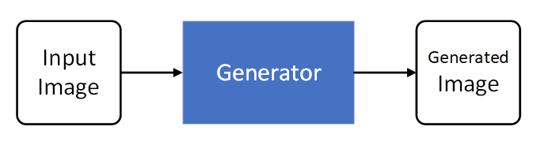
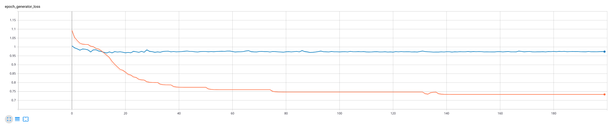
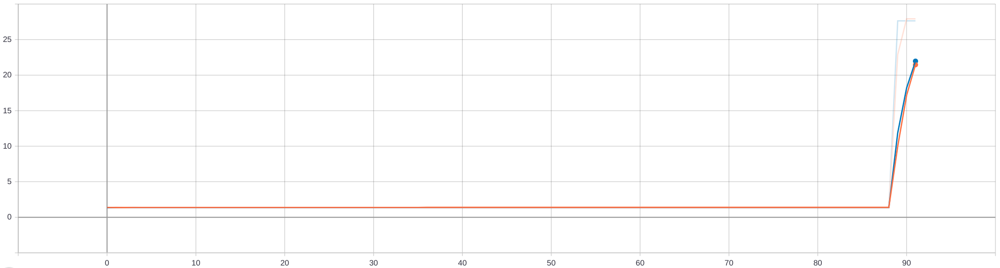

# Pix2Pix
#### by Malte Kleine-Piening, Raphael Marx and Christopher Bröcker (20.04.2020)

## 1 Motivation / Introduction
Our group decided to implement the [Image-to-Image Translation with Conditional Adversarial Networks](https://arxiv.org/abs/1611.07004) paper from Isola et al. (2018).

At first we were a little confused because at first glance the pix2pix model seemed to be able to do everything. It could e.g. translate from edges to handbags, from aerial images to maps, from labels to facades and from black-and-white to color.

Other papers that we looked at like [Colorful Image Colorization](https://arxiv.org/abs/1603.08511) only focused on one of these tasks and built a spezialized architecture just for that task.

The authors of the pix2pix paper, however, showed that the task in a lot of image translation problems is very similar and boils down to a more general approach: predicting pixels from pixels. Therefore they introduce a general framework that can be used on numerous different tasks.

We quite like this wide applicability and the ease of adopting the model for a whole new task.

## 2 Background knowledge (reference to most important publications)

In the past if you wanted to do any image-to-image translation you had to build a specialized tool for that specific task. With the introduction of CNNs and eventually GANs image prediction became a lot easier to implement.

Because we are going to talk more about Generative Adversarial Networks (GANs) in the upcoming sections we should briefly explain what they are. GANs were first introduced by [Goodfellow, I. (2014)](https://papers.nips.cc/paper/5423-generative-adversarial-nets) .

The basic idea is that you have 2 neural networks that are trying to work against each other and therefore improve themselves. One NN is called the generator and aims to produce the best fake data that it can while the second NN is called the discriminator which gets both this fake input and real input from the dataset and tries to differentiate between the two. In our case the data that is being produced are images.

If the generator produces an image that fools the discriminator the weights of the discriminator are adapted to better recognize the generated image and therefore improves its detection rate.

The pix2pix paper doesn't use the base GANs but a variation called cGans which stands for conditional GANs. cGANs don't just learn a mapping from random noise to output image but from observed image 
`x` to an output image `y`. Often random noise is added to the input image `x` to get non-deterministic results. We don't add random noise to the input, but use drop-out to generate randomness in our network while training and testing. They also learn a structured loss which penalizes the joint configuration of the output.

It is also important to mention that the pix2pix paper is not the first paper to use cGANs but the first one to not build something specifically for one task.

## 3 Model

A lot of the base architecture of the pix2pix model is based on [Radford, A. (2016)](https://arxiv.org/abs/1511.06434) who gave some architecture guidelines for deep convolutional GANs that are fully implemented in this paper: 

>Architecture guidelines for stable Deep Convolutional GANs:
>* Replace any pooling layers with strided ,convolutions (discriminator) and fractional-strided convolutions (generator).
>* Use batchnorm in both the generator and the discriminator.
>* Remove fully connected hidden layers for deeper architectures.
>* Use ReLU activation in generator for all layers except for the output, which uses Tanh.
>* Use LeakyReLU activation in the discriminator for all layers.

The paper defines the following types of convolutional layers that we decided to implement first. 

* C(k)
  * Convolution (k filters; 4x4; stride 2)
  * BatchNorm (in testing and training)
  * ReLU

```python
class C(Layer):
    """This layer represents the C(k) layer described in the pix2pix paper. The activation function 
        is a parameter to allow the use of different activation functions like ReLU and leaky ReLU for 
        encoder and decoder. The sampling_factor gives a factor by which the convolution output will be 
        sampled up or down. A value of 2 will sample the tensor up by 2. A value of 0.5 will sample the 
        tensor down by 2."""
        
    def __init__(self, k, activation=None, sampling='down', batchnorm=True):
        super(C, self).__init__()
        if sampling == 'up':
            self.conv = tf.keras.layers.Conv2DTranspose(k, kernel_size=4, strides=2, activation=None, padding='same')
        elif sampling == 'down':
            self.conv = tf.keras.layers.Conv2D(k, kernel_size=4, strides=2, activation=None, padding='same')
        else:
            raise AttributeError('illegal sampling mode: "' + str(sampling) + '"')
            
        self.batchnorm = None
        if batchnorm:
            self.batchnorm = tf.keras.layers.BatchNormalization()
            
        self.activation = activation
        
    def call(self, x):
        x = self.conv(x)
        
        if self.batchnorm != None:
            x = self.batchnorm(x)
        
        if self.activation != None:
            x = self.activation(x)
            
        return x
```

The only difference to the C(k) layer is that the CD(k) layer also uses a dropout rate of 50% so CD(k) inherits from C(k). 
* CD(k)
  * Convolution (k filters; 4x4; stride 2)
  * BathNorm (in testing and training)
  * Dropout (rate of 50%)
  * ReLU

```python
class CD(C):
    """This layer represents the CD(k) layer described in the pix2pix paper. The activation function 
        is a parameter to allow the use of different activation functions like ReLU and leaky ReLU for 
        encoder and decoder. The sampling_factor gives a factor by which the convolution output will be 
        sampled up or down. A value of 2 will sample the tensor up by 2. A value of 0.5 will sample the 
        tensor down by 2."""
    
    def __init__(self, k, activation=None, sampling=None, batchnorm=True):
        super(CD, self).__init__(k, activation, sampling, batchnorm)
        self.dropout = tf.keras.layers.Dropout(rate=0.5)

    def call(self, x):
        x = self.conv(x)
        
        if self.batchnorm != None:
            x = self.batchnorm(x)
        
        x = self.dropout(x)
        
        if self.activation != None:
            x = self.activation(x)
            
        return x
```

Next we will talk about the architecture of the model. 

### Generator
The generator should take an input image and create an image with the same structure, but different appearence. The authors use an encoder-decoder structure where they first downsample the input `x` multiple times and then upsample it again to the original dimension.

<div>


</div>

The downsampling creates an information bottleneck, because we lose a lot of information about where things are located. For many use cases you don't want to lose that much information while creating the new image. One example is image colorization, in which the objects displayed in input `x` and output `y` should be at the same position in the images. 

The paper from [Ronneberger, O. (2015)](https://arxiv.org/abs/1505.04597) introduced a type of CNN called UNet. The UNet is a special kind of encoder-decoder that adds skip connections between mirrored layers of the encoder and the corresponding decoder layer. By doing so we retain information about the higher resolution location and combine that during the decoding step with the output of our encoder. In the original UNet implementation they used a max pooling layer for downsampling. As said above the pix2pix authors followed the advice from [Radford, A. (2016)](https://arxiv.org/abs/1511.06434) and did not use maxpooling. 

Like for the discriminator, the following lists describe the encoder and decoder generator.

All convolutions of the encoder downsample the image and also apply batchnorm (except the first convolution).

encoder: (Leaky ReLU (slope = 0.2))
* C64
* C128
* C256
* C512
* C512
* C512
* C512
* C512

All decoder convolutions upsample the image and apply batchnorm. As said before, we use the UNet structure for the generator. This means that we have connections from the i-th layer to the (n - i)-th layer of the autoencoder.

UNet decoder: (ReLU)
* CD512
* CD1024
* CD1024
* C1024
* C1024
* C512
* C256
* C128
* reduction to output channels
* tanh

```python
class Generator(Model):
    def __init__(self, output_dim=3):
        super(Generator, self).__init__()
        
        # encoder:
        self.enc_conv1 = C(k=64, activation=tf.keras.layers.LeakyReLU(alpha=0.2), sampling="down", batchnorm=False)
        self.enc_conv2 = C(k=128, activation=tf.keras.layers.LeakyReLU(alpha=0.2), sampling="down")
        self.enc_conv3 = C(k=256, activation=tf.keras.layers.LeakyReLU(alpha=0.2), sampling="down")
        self.enc_conv4 = C(k=512, activation=tf.keras.layers.LeakyReLU(alpha=0.2), sampling="down")
        self.enc_conv5 = C(k=512, activation=tf.keras.layers.LeakyReLU(alpha=0.2), sampling="down")
        self.enc_conv6 = C(k=512, activation=tf.keras.layers.LeakyReLU(alpha=0.2), sampling="down")
        self.enc_conv7 = C(k=512, activation=tf.keras.layers.LeakyReLU(alpha=0.2), sampling="down")
        self.enc_conv8 = C(k=512, activation=tf.keras.layers.LeakyReLU(alpha=0.2), sampling="down")
        
        # decoder
        self.dec_conv1 = CD(k=512, activation=tf.keras.activations.relu, sampling="up")
        self.dec_conv2 = CD(k=1024, activation=tf.keras.activations.relu, sampling="up")
        self.dec_conv3 = CD(k=1024, activation=tf.keras.activations.relu, sampling="up")
        self.dec_conv4 = C(k=1024, activation=tf.keras.activations.relu, sampling="up")
        self.dec_conv5 = C(k=1024, activation=tf.keras.activations.relu, sampling="up")
        self.dec_conv6 = C(k=512, activation=tf.keras.activations.relu, sampling="up")
        self.dec_conv7 = C(k=256, activation=tf.keras.activations.relu, sampling="up")
        self.dec_conv8 = C(k=128, activation=tf.keras.activations.relu, sampling="up")
        
        self.out = tf.keras.layers.Conv2D(output_dim, kernel_size=3, strides=1, activation=tf.keras.activations.tanh, padding='same')
        
    def call(self, x):
        # encoder
        x1 = self.enc_conv1(x)
        x2 = self.enc_conv2(x1)
        x3 = self.enc_conv3(x2)
        x4 = self.enc_conv4(x3)
        x5 = self.enc_conv5(x4)
        x6 = self.enc_conv6(x5)
        x7 = self.enc_conv7(x6)
        x8 = self.enc_conv8(x7)
        
        # decoder
        # implementing skip connections by concatenation
        x = self.dec_conv1(x8)
        x = self.dec_conv2(tf.keras.layers.concatenate([x, x7]))
        x = self.dec_conv3(tf.keras.layers.concatenate([x, x6]))
        x = self.dec_conv4(tf.keras.layers.concatenate([x, x5]))
        x = self.dec_conv5(tf.keras.layers.concatenate([x, x4]))
        x = self.dec_conv6(tf.keras.layers.concatenate([x, x3]))
        x = self.dec_conv7(tf.keras.layers.concatenate([x, x2]))
        x = self.dec_conv8(tf.keras.layers.concatenate([x, x1]))
        
        # get three channels
        x = self.out(x)
        return x
```

### Discriminator

The discriminator gets two inputs. The first is always the input image that the generator used to create an image and the second is either the original image from the dataset or the generated image. It learns to classify the second image into the groups real (class `0`) or fake (class `1`).

The authors named their specific discriminator *PatchGAN*. This discriminator only classifies if a `N * N`-patch of the image is real or fake and is applied by convolution to the whole image. Thereby it punishes local errors in the image and assumes independence to pixels outside of the patch. The results of all patches are averaged to get a classification for the whole image.
An advantage of *PatchGAN* is that a trained discriminator can be applied to larger images than it was trained on. The paper shows that the `70 * 70` discriminator gives a great balance between quality and training time. 

Below is the smaller `16 * 16` discriminator which also uses the described *C*-layer. Remember that each *C*-layer downsamples with `kernel_size=4` and `strides=2`.
We implemented the patch sizes `N = 16, 70, 286` that can all be found in `pix2pix.ipynb`. 

```python
# 16 x 16 discriminator:
class Discriminator16(Model):
    def __init__(self):
        super(Discriminator16, self).__init__()
        self.conv1 = C(k=64, activation=tf.keras.layers.LeakyReLU(alpha=0.2), sampling="down", batchnorm=False)
        self.conv2 = C(k=128, activation=tf.keras.layers.LeakyReLU(alpha=0.2), sampling="down")
        
        # flatten and dense with one neuron and sigmoid is the same as conv to 1D and sigmoid
        self.flatten = tf.keras.layers.Flatten()
        self.out = tf.keras.layers.Dense(1, activation=tf.keras.activations.sigmoid)
        
    def call(self, x, y):
        """Calls the discriminator with input x and generator output or the original image y """
        x = tf.keras.layers.concatenate([x, y])
        x = self.conv1(x)
        x = self.conv2(x)
        x = self.flatten(x)
        x = self.out(x)
        return x
```

### Training
In each training step the generator creates an image from a given input image. 
Then the discriminator is called twice. Once with the input image and the original image and once with the input image and the generated image. Both times the discriminator classifies the image as either real or fake. 



<div>


</div>

From these classifications (*disc_real* and *disc_fake*) we compute the discriminator loss. The loss is minimized if the discriminator recogizes the generated image as fake (`1`) and the original image as real (`0`). #TODO Erklärung und endgültiger code 

```python
    def _disc_loss(self, disc_real, disc_fake):
        """Calculates the loss for the discriminator based on the discriminator output of the real and fake image.
        Args:
            disc_real: discriminator output for real image
            disc_fake: discriminator output for generated (fake) image
        """
        #return self.cross_entropy(tf.ones_like(disc_real), disc_real) + self.cross_entropy(tf.zeros_like(disc_fake), disc_fake)
        #return tf.reduce_mean(tf.math.log(disc_real)) + tf.reduce_mean(tf.math.log(1 - disc_fake))
        return tf.reduce_mean(-(tf.math.log(disc_real + 1e-12) + tf.math.log(1 - disc_fake +  + 1e-12)))
```

For the generator loss (*gen_loss*) the authors propose to use the discriminator output to compute the *gan_loss* and combine that value with the L1 loss. The *gan_loss* is minimized if the discriminator classifies the generated image as real. The L1 loss is the mean absolute deviation of the generated image (*generated*) from the original image. By adding this to the loss function, the generators objective is to fool the discriminator and also generate images close to the desired original image.

```python
    def _gen_loss(self, y, generated, disc_fake):
        """Calculates the loss for the generator based on the output, the generated image 
        and the discriminator output for the generated image.
        Args:
            y: dataset output
            generated: generated output
            disc_fake: discriminator output for generated image
        """
        #gan_loss = self.cross_entropy(tf.ones_like(disc_fake), disc_fake)
        gan_loss = tf.reduce_mean(-tf.math.log(disc_fake + 1e-12))
        l1_loss = tf.reduce_mean(tf.abs(y - generated))
        return gan_loss + (600 / self.output_dim) * l1_loss
```

With the Adam optimizer and these losses we update the weights of the generator and discriminator.

### Keas model
To ease up the implementation of new examples for our pix2pix model, we combined the generator and discriminator into one class that derives from `tf.keras.Model`.
This class also includes the loss functions as well as the functions keras recommends to implement.
These functions are mainly used for prediction of results, training of the model and testing of the model.

The function `fit` takes numpy arrays of inputs and targets in addition to some variables like batch_size or epochs to train the model.
Before training the discriminator and generator however the data will be prepared for training.
As a part of this process, the dataset will be split up into training and testing dataset.
If the testing data is provided by the `validation_data` parameter of the function, it will be used for testing.
If it is not given, the `x` and `y` will be split by the `validation_split` parameter of the functions.
After generating trainig and testing dataset as numpy arrays, tensorflow datasets are being build from these.
After this the training process starts.
While training, callbacks are care being called exacly as the [TensorFlow documentation](https://www.tensorflow.org/api_docs/python/tf/keras/callbacks/Callback) tells.
This allows the use of callbacks like checkpoints progressbars, tensorboard and much more.

Checkpoints are especially useful for cases in which the programm might crash while training.
For our examples we also implemented an automated restoration of a previous checkpoint before the training process starts.
To allow monitoring the losses during the training process we used tensorboard and its keras callback which adds the losses live.

## 4 Experiments
After implementing the pix2pix model and our training process, we needed an experiment to try it out and see some results.
Because the authors of the original pix2pix paper showed that their approach can be applied to a lot of problems, we chose four different problems for our experimenents.

Due to the different formats of the datasets we used, we applied the random jitter described in the paper at loading time of the images.

### facades
To validate that our implementation works just as the implementation of the pix2pix authors, we chose a problem used in the original paper as our first experiment.
From the experiments shown in the paper we selected the facades example mainly because of the low training time mentioned in the paper.

The purpose of this experiment is to generate images of facades that look like real photos from dense labels of the facades elements.
To achieve this we used the CMP Facade Dataset which was used in the paper [CMP Facade Database](http://cmp.felk.cvut.cz/~tylecr1/facade/).
This dataset contains about 400 data samples.
The following image shows example inputs and targets which have been taken out of the dataset.
Each type of label of facade elements has its own rgb color assigned to it.
Because the facades are labeled densely, the input is an rgb image and so is the target output which is a photograph of a real building matching the labels of the input image.


For the facades example we implemented the random jitter as described in the paper.
So we first upscale the image to 286x286 and random crop it down to 256x256.
Additionally we mirror half of the images from left to right like they described in the paper.
We also use this procedure as data augmentation by using some images two or more times to increase our dataset size.

### winter to summer
After reimplementing the facades example we wanted to try something different.
To do so, we modified an example from the paper to create a new experiment.
Therefore we took the day to night example and wanted to use use its dataset to create a winter to summer converter.

A similar example has been chosen for cycleGAN which is another image to image generative network.
They however chose a summer to winter dataset they build themselves by using the flickr api while we used the [Transient Attributes for High-Level Understanding and Editing of Outdoor Scenes](http://transattr.cs.brown.edu/) which has been published by the Brown University.
The dataset we chose contains abount 8500 images annotated from about 100 webcams.

To get only summer and winter images, we filter the dataset by their label which gives us about 300 samples when collecting some winter-summer pairs per webcam.
This seems to be too low of a number of samples to expect good results but we wanted to try this out anyways.
The selection of multiple samples per webcam gives us a lot of random noise which removes the need of applying a random jitter.

The following image shows some samples of the dataset we used for this experiment.


### sparse mono depth perception
Because of our high interest in robotics and 3D sensor data we chose some examples from this area as our next experiments.
The first of those is the perception of sparse depthmaps from monocular cameras.
So the basic idea was to put an rgb image taken from a moving vehicle into the network and get a one dimensional depthmap as the output.
A System like this could be useful to cut the costs of expensive rangefinding systems in production of robotic systems or be used for LiDaR data validation in self driving automotives.

The dataset we used for this is the depth prediction benchmark from the widely used [kitti dataset](http://www.cvlibs.net/datasets/kitti/eval_depth.php?benchmark=depth_prediction).
The dataset contains samples with rgb images and depthmaps generated from a multi layered LiDaR scan.
Because the images and depthmaps are very wide, we applied the random jitter by using the full height of the image and randomly cropping vertically.
Additionally we again applied a random mirroring of the input and target images.
After this jittering and data augmentation our dataset has about 2000 samples with input and target images.

The following image shows some samples taken out of the dataset.
The pixels of the depthmap colored in the darkest blue show that there is no measurement for that pixel while all other colors describe different distances.
Yellow colored pixels are measurements of long distances and blue colored pixels are measurements of short distances.


### sparse to dense depthmap
For our last experiment we wanted to use sparse depthmaps to generate dense depthmaps.
This is a common problem when using for example stereo cameras to obtain depth information because not every part of the scene is seen by both cameras.
Parts can be hidden from one camera but not from the other.
Situations like this produce areas without depth information in the resulting depthmap.

This is exacly what images of the [NYU Depth Dataset](https://cs.nyu.edu/~silberman/datasets/nyu_depth_v2.html) look like.
This dataset also includes precomputed and validated ground truth dense depthmaps for each of these sparse depthmaps.
Because of this and the amount of 1500 samples included in this dataset we chose the NYU Depth Dataset for our last experiment.

The following image shows some examples of the dataset we selected.
Because both the input and output images are one dimensional, the colorization matches our colorization of the target images included in the kitti dataset.


## 5 Visualization and Results

### facades
We trained our facades example as described by the authors for 200 epochs.
For the batchsize we chose 10 to improve our parallelization.
This resulted in a training time of abount 3 hours using one NVIDIA Geforce GTX 1080.
Some results of our testing dataset and the generator as well as the discriminator losses are shown below.

The losses do not change much after the first epochs.
The cause of this mainly lies in the GAN architecture used in this paper.
Both discriminator and generator try to work against each other which results in constant losses later in the training process.

One can clearly see that the results look pretty good however not as good as shown in the paper.
Other implementations like [this online pix2pix demo](https://zaidalyafeai.github.io/pix2pix/facades.html) also have worse results than the results shown in the paper.
We tried differend optimizations including dividing the objective of the discriminator by two as it is described in the paper or using a batchsize of 1 but our results always turned out to be equal or worse than the results presented here.

The results of our first experiment show that our implementation works generally speaking.
It is not optimized to show the best results possible with our architecture but the results are pretty decent.

#### results after epoch 200


#### discriminator loss


#### generator loss



### winter to summer
Our second example was the conversion from winter scenes to summer scenes.
We again used a batchsize of 10 and trained for 200 epochs.
This took abount 2 hours on our system with the GTX 1080.

As already noticed in the previous section our dataset contains very few samples which was actually a problem.
We noticed that the network was quickly overfitting.
This can be seen when taking a look at the results on our training dataset below.
The generator generates correct mountains in full foggy environments and puts cars on the street when there are also cars on the street in the target images.
Additionlly the results on our testing dataset were absolutely blurry and generally pretty bad.

One could speak of a failure for this example.

#### training dataset after epoch 200


#### testing dataset after epoch 200


### sparse mono depth perception
Our third experiment was the depth perception from monocular cameras.
We again used a batchsize of 10 and trained for 100 epochs.
This took about 10 hours on our testing system.

The results on our testing dataset and the losses are shown below.
The results look already pretty nice after epoch 50 but are nearly perfect after epoch 100.
The loss of the discriminator goes up for the testing dataset which looks like the discriminator is overfitting our training data.
Our results however get better and better over time. 

A problem with our results is that the color of the points that have no distances is slightly lighter than in the target image.
This lighter blue color stands for short distance which destroys the purpose of our depthmap.
One could solve that problem by using a second output channel as kind of an alpha channel for our distances.
This could simply be computed on the kitty dataset by filtering the target depthmap to get only the parts that have no distance assigned.

This clear success in our mono depth perception example shows that pix2pix can be applied to very different problems from different fields of research.
On the one hand it can produce photographs and on the other hand approximate distances by looking at images.

#### results after epoch 50


#### results after epoch 100


#### discriminator loss


#### generator loss


### sparse to dense depthmap
Our last example is the generation of dense depthmaps from sparse depthmaps.
This is as described in the previous section a common problem with stereo camera systems.
For this example we again used a batchsize of 10 and our GTX 1080 system.
Training on this system for 90 epochs took about 8 hours.

Our results on the testing dataset are again shown below.
This time our loss got minimized until epoch 89 where suddenly a spike in both losses appeared.
We could not explain why this happened but it did not hurt our results.

The results for epoch 50 already started closing the holes in our depthmap.
This closing of all the holes works out pretty well after epoch 70 but is very impressive after epoch 90.
There are only small hints about where the holes have been and our system managed to solve even hard situations like the last one shown below.

This last example showed that pix2pix is really capable of being used to solve problems like depthmap generation or depthmap postprocessing which are very different from those shown in the paper.
One could also say that our implementation of the pix2pix network generates good looking results and works generally speaking.

#### results after epoch 50


#### results after epoch 70


#### results after epoch 90


#### discriminator loss


#### generator loss

